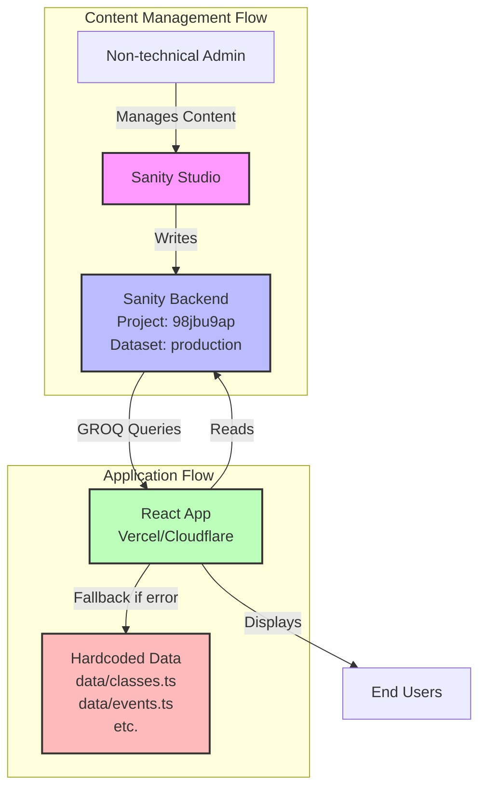

# Sanity CMS Migration Plan

## Overview

Migrate hardcoded content (Classes, Events, Gallery, Instructors, DJs, Hero, About, Contact) to Sanity CMS while maintaining fallback data for reliability. Enable content management through Sanity Studio for non-technical users.

## Architecture



## Migration Strategy

**Migrate to Sanity:**

- Classes (`data/classes.ts`)
- Events (`data/events.ts`)
- Gallery (`data/galleryMedia.ts`)
- Instructors (hardcoded in `components/Instructors.tsx`)
- DJs (hardcoded in `components/DJs.tsx`)
- Hero content (hardcoded in `components/Hero.tsx`)
- About content (hardcoded in `components/AboutPreview.tsx`)
- Contact info (hardcoded in `components/Contact.tsx`)

**Keep Hardcoded:**

- Navigation structure
- Footer structure
- Layout/styling
- Code of Conduct

**Fallback Pattern:**

All components will use fallback data if Sanity fetch fails, ensuring app never breaks.

## Implementation Plan

### Phase 1: Sanity Schemas Setup

Create schemas in `studio-zoukitup/schemas/`:

1. **Class Schema** (`class.ts`)

   - Fields: title, slug, description, level, instructors, schedule, location, firstClass, goals (array), whatYouWillLearn (array), entryRequirements (array), videoUrl, zaloLink, messengerLink
   - Reference: `data/classes.ts` interface

2. **Event Schema** (`event.ts`)

   - Fields: title, slug, type (social/workshop/festival), description, date, dateRange, location, dj, poster (image), guestInstructors (array), schedule (array), zaloLink, messengerLink
   - Reference: `data/events.ts` interface

3. **Instructor Schema** (`instructor.ts`)

   - Fields: name, image, description, order (number for sorting)

4. **DJ Schema** (`dj.ts`)

   - Fields: name, image, description, link, platform (soundcloud/mixcloud)

5. **Gallery Item Schema** (`galleryItem.ts`)

   - Fields: type (image/video), url, title, order (number)

6. **Site Settings Schema** (`siteSettings.ts`) - Singleton

   - Fields: heroTitle, heroSubtitle, heroDescription, heroCTA1, heroCTA2, aboutTitle, aboutContent (array of blocks), contactAddress, contactPhone, contactEmail, socialLinks (object with facebook, instagram, youtube)

7. **Update** `studio-zoukitup/schemas/index.ts` to export all schemas

### Phase 2: Data Migration

1. Export data from:

   - `data/classes.ts` → Import to Sanity (Classes)
   - `data/events.ts` → Import to Sanity (Events)
   - `data/galleryMedia.ts` → Import to Sanity (Gallery)
   - `components/Instructors.tsx` → Add to Sanity (Instructors)
   - `components/DJs.tsx` → Add to Sanity (DJs)

2. Create Site Settings document in Sanity with current Hero/About/Contact content

3. Verify all documents are published

### Phase 3: Create Sanity Utilities

1. **Update** `lib/sanityQueries.ts` with queries:

   - `allClassesQuery` - Get all classes ordered
   - `classBySlugQuery(slug)` - Get single class
   - `allEventsQuery` - Get all events ordered
   - `eventBySlugQuery(slug)` - Get single event
   - `allInstructorsQuery` - Get instructors ordered by order field
   - `allDJsQuery` - Get all DJs
   - `allGalleryItemsQuery` - Get gallery items ordered
   - `siteSettingsQuery` - Get site settings (singleton)

2. **Create** `lib/sanityHooks.ts` with React hooks:

   - `useClasses()` - Fetch classes with fallback
   - `useClass(slug)` - Fetch single class with fallback
   - `useEvents()` - Fetch events with fallback
   - `useEvent(slug)` - Fetch single event with fallback
   - `useInstructors()` - Fetch instructors with fallback
   - `useDJs()` - Fetch DJs with fallback
   - `useGallery()` - Fetch gallery with fallback
   - `useSiteSettings()` - Fetch site settings with fallback

Each hook pattern:

   ```typescript
   const [data, setData] = useState(fallbackData);
   useEffect(() => {
     fetchFromSanity()
       .then(setData)
       .catch(() => console.error('Using fallback'));
   }, []);
   ```

### Phase 4: Update Components

Update components to use Sanity hooks with fallback:

1. **`components/Schedule.tsx`**

   - Use `useClasses()` and `useEvents()`
   - Fallback: existing `fallbackClasses` and `fallbackEvents`

2. **`pages/ClassesPage.tsx`**

   - Use `useClasses()`
   - Fallback: import from `data/classes.ts`

3. **`pages/ClassDetailPage.tsx`**

   - Use `useClass(slug)`
   - Fallback: find in `data/classes.ts` by slug

4. **`pages/EventsPage.tsx`**

   - Use `useEvents()`
   - Fallback: import from `data/events.ts`

5. **`pages/EventDetailPage.tsx`**

   - Use `useEvent(slug)`
   - Fallback: find in `data/events.ts` by slug

6. **`components/Gallery.tsx`**

   - Use `useGallery()`
   - Fallback: import from `data/galleryMedia.ts`

7. **`components/Instructors.tsx`**

   - Use `useInstructors()`
   - Fallback: existing hardcoded array

8. **`components/DJs.tsx`**

   - Use `useDJs()`
   - Fallback: existing hardcoded array

9. **`components/Hero.tsx`**

   - Use `useSiteSettings()`
   - Fallback: existing hardcoded content

10. **`components/AboutPreview.tsx`**

    - Use `useSiteSettings()`
    - Fallback: existing hardcoded content

11. **`components/Contact.tsx`**

    - Use `useSiteSettings()`
    - Fallback: existing hardcoded contact info

### Phase 5: Deploy Configuration

1. **Update** `vite.config.ts`:

   - Change `base` from `/zoukitup-redesign/` to `/` for Vercel/Cloudflare
   - Change `build.outDir` from `docs` to `dist`

2. **Create** `.env.example`:
   ```
   VITE_SANITY_STUDIO_URL=https://your-project.sanity.studio
   VITE_BASE=/
   ```

3. **Deploy Sanity Studio**:

   - Run `cd studio-zoukitup && npm run deploy`
   - Copy Studio URL
   - Add to Vercel/Cloudflare env vars as `VITE_SANITY_STUDIO_URL`

4. **Update** `App.tsx`:

   - Add render for `StudioPage` when `currentPage === 'studio'`

### Phase 6: Testing

1. Test all components load data from Sanity
2. Test fallback when Sanity unavailable (simulate network error)
3. Test image loading from Sanity
4. Test production build: `npm run build`
5. Test preview: `npm run preview`
6. Verify no console errors
7. Test content updates in Studio appear on frontend

### Phase 7: Documentation

1. **Create** `CONTENT_MANAGEMENT_GUIDE.md`:

   - How to access Sanity Studio
   - How to add/edit Classes, Events, Gallery items
   - How to update Instructors, DJs
   - How to update Site Settings

2. **Update** `SANITY_INTEGRATION.md`:

   - Architecture overview
   - How to add new schemas
   - Troubleshooting guide

## Files to Create/Modify

**Create:**

- `studio-zoukitup/schemas/class.ts`
- `studio-zoukitup/schemas/event.ts`
- `studio-zoukitup/schemas/instructor.ts`
- `studio-zoukitup/schemas/dj.ts`
- `studio-zoukitup/schemas/galleryItem.ts`
- `studio-zoukitup/schemas/siteSettings.ts`
- `lib/sanityHooks.ts`
- `.env.example`
- `CONTENT_MANAGEMENT_GUIDE.md`

**Modify:**

- `studio-zoukitup/schemas/index.ts` - Export all schemas
- `lib/sanityQueries.ts` - Add new queries
- `components/Schedule.tsx` - Use Sanity hooks
- `pages/ClassesPage.tsx` - Use Sanity hooks
- `pages/ClassDetailPage.tsx` - Use Sanity hooks
- `pages/EventsPage.tsx` - Use Sanity hooks
- `pages/EventDetailPage.tsx` - Use Sanity hooks
- `components/Gallery.tsx` - Use Sanity hooks
- `components/Instructors.tsx` - Use Sanity hooks
- `components/DJs.tsx` - Use Sanity hooks
- `components/Hero.tsx` - Use Sanity hooks
- `components/AboutPreview.tsx` - Use Sanity hooks
- `components/Contact.tsx` - Use Sanity hooks
- `vite.config.ts` - Update base path and output dir
- `App.tsx` - Add StudioPage render
- `SANITY_INTEGRATION.md` - Update with new info

**Keep (Fallback):**

- `data/classes.ts` - Keep as fallback
- `data/events.ts` - Keep as fallback
- `data/galleryMedia.ts` - Keep as fallback

## Success Criteria

- All content manageable through Sanity Studio
- App works with fallback data if Sanity fails
- No breaking changes to existing functionality
- Production build succeeds w